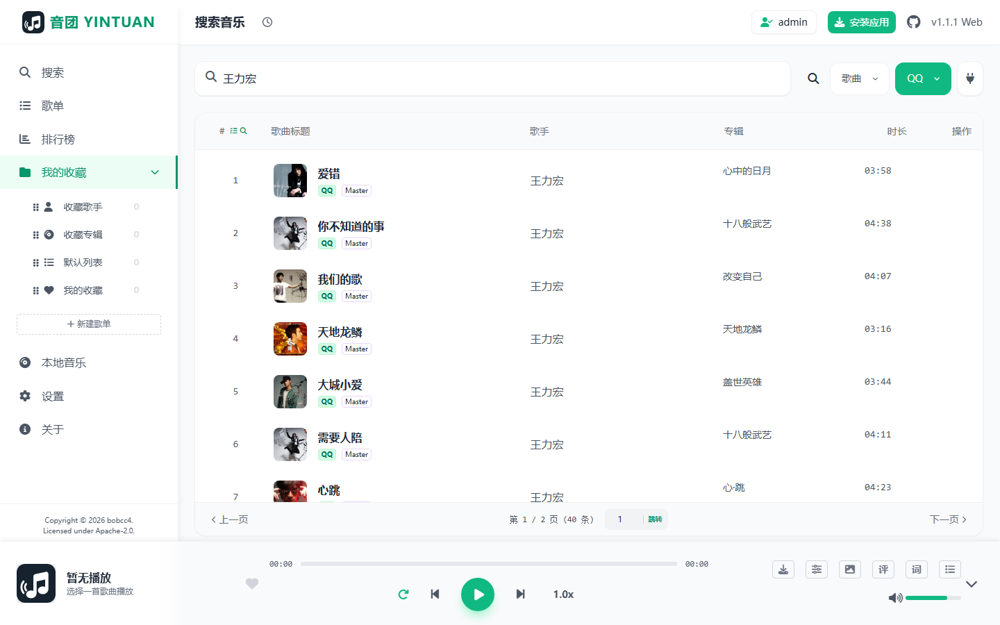
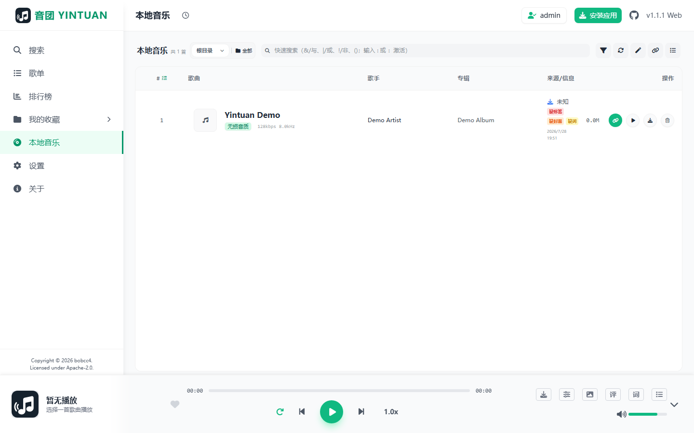
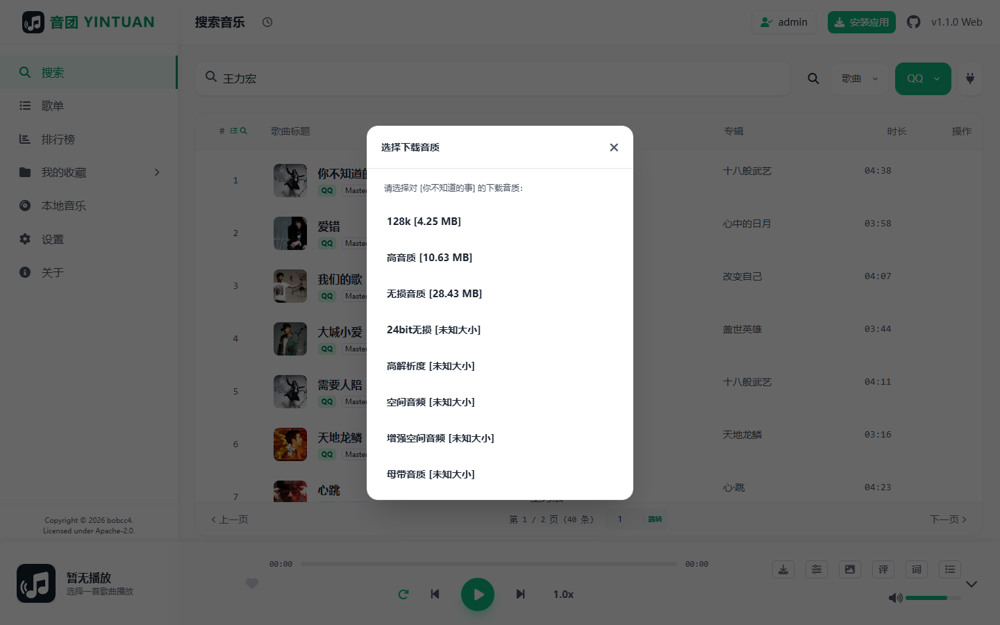
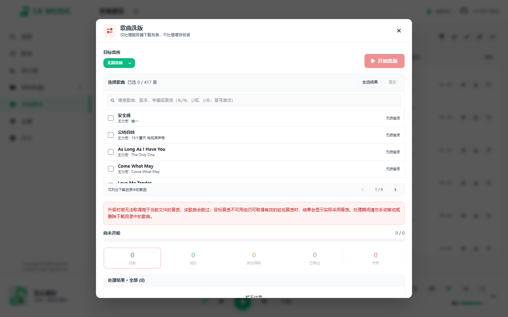
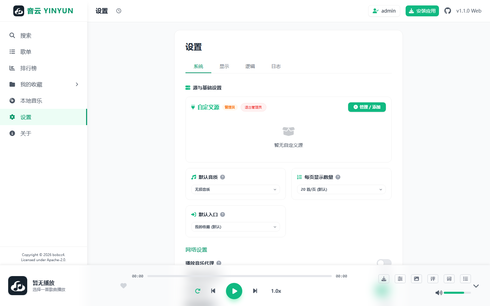
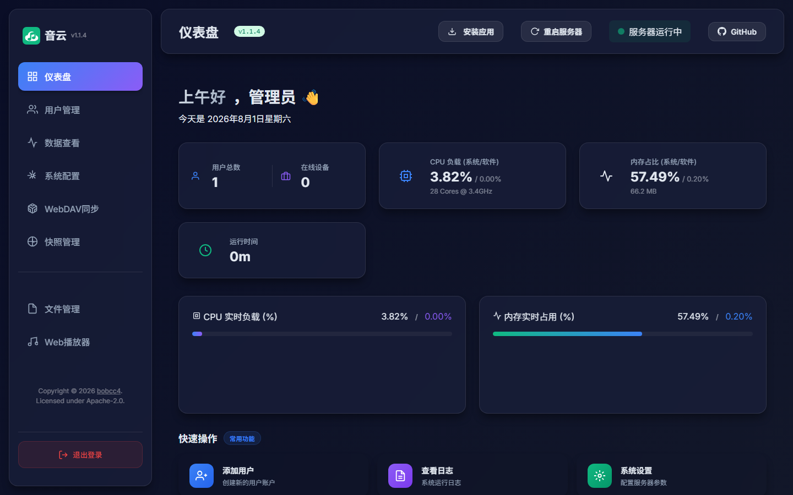
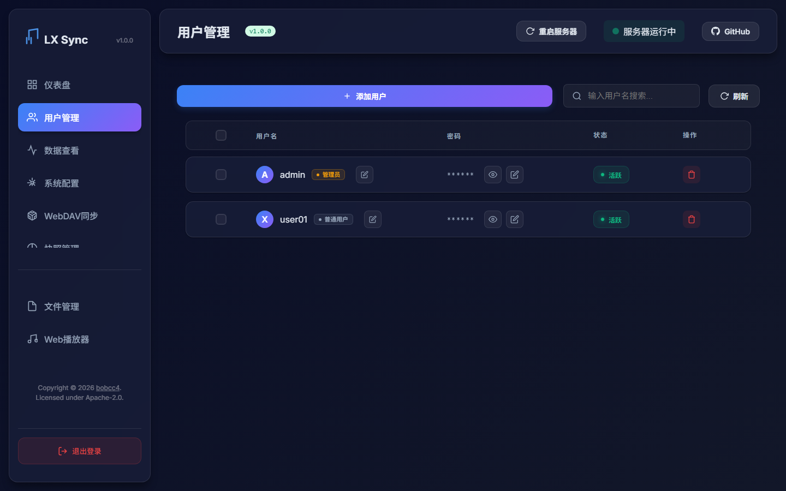
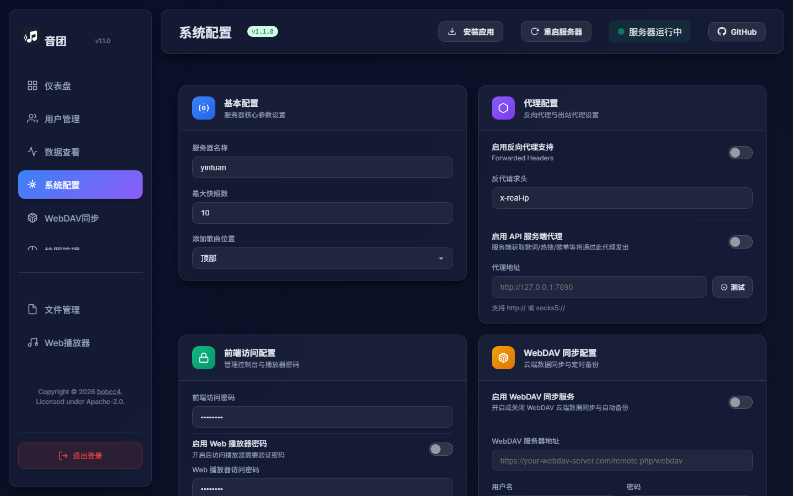
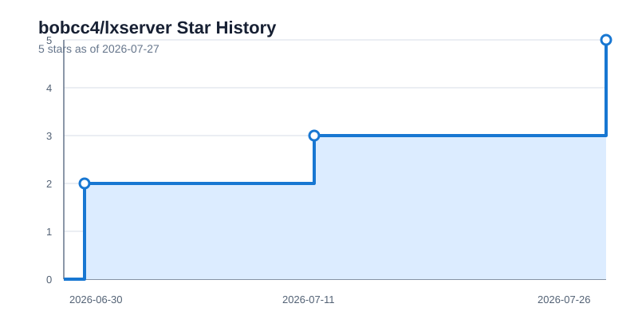

# Yinyun

<p align="center"></p>

<div align="center">
  <p>
    
    
    
    
    <br>
    <br>
    <a href="https://github.com/bobcc4/lxserver/stargazers"></a>
    <a href="https://github.com/bobcc4/lxserver/network/members"></a>
    <a href="https://github.com/bobcc4/lxserver/issues"></a>
    <a href="https://github.com/bobcc4/lxserver/commits/main"></a>
    
    <a href="https://github.com/bobcc4/lxserver/releases"></a>
  </p>
</div>

[Documentation](https://bobcc4.github.io/lxserver/) | [SyncServer](md/lxserver_EN.md) | [Changelog](changelog.md) | [中文版](README.md)

---
**Yinyun** is a self-hosted music server with a Web player, downloads, local-library management, LX Music data synchronization, and Subsonic client support.

## ✨ Web Player Key Features

### 1. Multi-platform Search and Playback

Search across major music platforms from one interface. Results can be played, favorited, or downloaded directly, with quick source and content-type filters.

<p align="center">
  
</p>

### 2. Local Library Management

Scan `/music` and `/cache`, including nested directories. Use quick search, advanced Boolean filters, batch selection, playlist collection, and metadata management.

<p align="center">
  
</p>

### 3. Eight Quality Levels and Server Downloads

Choose from standard, high, lossless, 24-bit lossless, Hi-Res, Atmos, enhanced Atmos, and master quality. The download dialog shows the resolved file size and source platform, while server-side queues continue after the browser closes.

<p align="center">
  
</p>

### 4. Local Track Remastering

Filter and batch-select local tracks for replacement at a chosen target quality. When the target is unavailable, configurable fallback is supported and the result lists successful and failed tracks.

<p align="center">
  
</p>

### 5. Player Settings and Custom Sources

Configure default quality, caching, downloads, proxies, lyrics, themes, audio effects, and playback behavior. Each user can select enabled platforms per custom source, including independently configured shared sources.

<p align="center">
  
</p>

### 6. Service Status and Maintenance

The dashboard summarizes connections, users, uptime, and resource usage, with direct access to data, snapshots, WebDAV, logs, and maintenance tools.

<p align="center">
  
</p>

### 7. Users and Permissions

Create and manage sync accounts, identify administrator accounts, inspect connected devices, and keep each user's sync data, custom sources, cache, and download directories isolated.

<p align="center">
  
</p>

### 8. Server Configuration

Configure access paths, synchronization modes, Subsonic, WebDAV, cache limits, proxies, and other server options from the dashboard. Docker environment variables retain the highest priority.

<p align="center">
  
</p>

### 9. Subsonic Protocol and Online Search

Connect clients such as Stream Music, LMP, and Feishin to the local library and playlists through the Subsonic API. Search supports `wy:`, `kg:`, `tx:`, `kw:`, and `mg:` platform prefixes, plus `online:` and `local:` scope prefixes.

## 🔒 Access Control & Security
To protect your privacy, the Web Player supports password protection.
### How to Enable

1. **Environment Variable** (Recommended for Docker users):
   - `ENABLE_WEBPLAYER_AUTH=true`: Enable authentication
   - `WEBPLAYER_PASSWORD=yourpassword`: Set access password
2. **Web Interface**:
   Log in to the management dashboard (default port 9527), go to **"System Config"**, check **"Enable Web Player Password"** and set your password.

## 📱 Mobile Adaptation
The Web Player is deeply optimized for mobile devices, providing a native App-like experience in mobile browsers.

---

## 🚀 Quick Start

Built with **Node.js**, supporting multiple deployment methods.

Running from source requires Node.js `22.12.0` or later. Node.js 24 LTS is recommended.


### Option 1: Desktop Client

Run Yinyun through the desktop client on Windows, macOS, and Linux.

- **📦 Download Latest**: [GitHub Releases](https://github.com/bobcc4/lxserver/releases/latest)
- **✨ Key Advantages**:
    - **Single Window**: Integrated management dashboard and Web player for a unified experience.
    - **System Tray**: Minimizes to tray on close, ensuring the sync service stays active in the background.
    - **Port Conflict Resolution**: Automatically detects and switches ports if the default is in use.
    - **Setup Wizard**: Guided data path selection on first launch, supports **Portable Mode**.
    - **Multi-Arch Support**: Builds for Windows (x64/x86/ARM64 Setup & Portable), macOS (Intel x64 & Apple Silicon arm64), and Linux (amd64/arm64 deb/AppImage).

### Option 2: Containerized Deployment via Docker

This project supports pulling images from Docker Hub or GitHub Packages:
- **Docker Hub**: `bobcc4/lxserver:v1`
- **GitHub Packages**: `ghcr.io/bobcc4/lxserver:v1`

**Docker Run Example:**

```bash
docker run -d \
  -p 9527:9527 \
  -v $(pwd)/data:/server/data \
  -v $(pwd)/logs:/server/logs \
  -v $(pwd)/cache:/server/cache \
  -v $(pwd)/music:/server/music \
  --name yinyun \
  --restart unless-stopped \
  bobcc4/lxserver:v1
```

**Docker Compose Example:**

Create a `docker-compose.yml` file:

```yaml
version: '3'
services:
  yinyun:
    image: bobcc4/lxserver:v1
    container_name: yinyun
    restart: unless-stopped
    ports:
      - "9527:9527"
    volumes:
      - ./data:/server/data
      - ./logs:/server/logs
      - ./cache:/server/cache
      - ./music:/server/music
    environment:
      - NODE_ENV=production
      # - FRONTEND_PASSWORD=123456
      # - ENABLE_WEBPLAYER_AUTH=true
      # - WEBPLAYER_PASSWORD=yourpassword
      # - ADMIN_PATH=
      # - PLAYER_PATH=/music
```

### Option 3: Manual Run (Git Clone)

```bash
# 1. Clone project
git clone https://github.com/bobcc4/lxserver.git && cd lxserver

# 2. Install dependencies and build
npm ci && npm run build

# 3. Start service
npm start
```

### Option 4: Using Release Build

1. Download the archive from GitHub Releases.
2. Extract and run `npm install --production`.
3. Execute `npm start`.

### 3. Access Info

- **Web Player**: `http://your-ip:9527/music` (Default path, configurable via `PLAYER_PATH`)
- **Sync Dashboard**: `http://your-ip:9527` (Default path, configurable via `ADMIN_PATH`, default password: `123456`)

---

## 🏗️ Architecture

Separated frontend and backend architecture based on Node.js:

- **Backend (Express + WebSocket)**: Core sync logic and WebDAV backup.
- **Console (Vanilla JS)**: Located in the root directory, handles user and data management.
- **WebPlayer (Vanilla JS)**: Handles music playback, default access path is `/music`.

---

## 🛠️ Configuration

Edit `config.js` directly. Environment variables take precedence:

| Env Variable | Config Key | Description | Default |
| --- | --- | --- | --- |
| `PORT` | `port` | Service port | `9527` |
| `BIND_IP` | `bindIP` | Binding IP | `0.0.0.0` |
| `ADMIN_PATH` | `admin.path` | Backend management interface path | (empty) |
| `PLAYER_PATH` | `player.path` | Web player access path | `/music` |
| `SUBSONIC_ENABLE` | `subsonic.enable` | Enable Subsonic protocol support | `true` |
| `SUBSONIC_PATH` | `subsonic.path` | Subsonic access path | `/rest` |
| `FRONTEND_PASSWORD` | `frontend.password` | Web dashboard password | `123456` |
| `SERVER_NAME` | `serverName` | Sync service name | `yinyun` |
| `MAX_SNAPSHOT_NUM` | `maxSnapshotNum` | Max snapshots to keep | `10` |
| `CONFIG_PATH` | - | Absolute path to external config file | - |
| `DATA_PATH` | - | Absolute path to data storage directory | `./data` |
| `LOG_PATH` | - | Absolute path to log output directory | `./logs` |
| `PROXY_HEADER` | `proxy.header` | Proxy IP header (e.g., `x-real-ip`) | - |
| `USER_ENABLE_ROOT` | `user.enableRoot` | Enable root path (use `ip:port`, password must be unique) | `true` |
| `USER_ENABLE_PATH` | `user.enablePath` | Enable user path (use `ip:port/username`, passwords can repeat) | `false` |
| `WEBDAV_ENABLE` | `webdav.enable` | Enable WebDAV sync and backup | `false` |
| `WEBDAV_URL` | `webdav.url` | WebDAV URL | - |
| `WEBDAV_USERNAME` | `webdav.username` | WebDAV Username | - |
| `WEBDAV_PASSWORD` | `webdav.password` | WebDAV Password | - |
| `WEBDAV_SYNC_PATH` | `webdav.syncPath` | WebDAV remote sync path | `/lx-sync` |
| `WEBDAV_BACKUP_PATH` | `webdav.backupPath` | WebDAV remote backup path | `/lx-sync-backups` |
| `SYNC_INTERVAL` | `sync.interval` | WebDAV incremental sync interval (min) | `60` |
| `BACKUP_INTERVAL` | `sync.backupInterval` | WebDAV full backup interval (hours) | `24` |
| `ENABLE_WEBPLAYER_AUTH` | `player.enableAuth` | Enable Web Player password | `false` |
| `WEBPLAYER_PASSWORD` | `player.password` | Web Player password | `123456` |
| `DISABLE_TELEMETRY` | `disableTelemetry` | Disable anonymous telemetry and update notifications | `false` |
| `ENABLE_LOGIN_USER_CACHE_RESTRICTION` | `user.enableLoginCacheRestriction` | Enable cache settings restriction for logged-in non-admin users | `false` |
| `ENABLE_CACHE_SIZE_LIMIT` | `user.enableCacheSizeLimit` | Enable cache size limit (auto-cleanup via LRU) | `false` |
| `CACHE_SIZE_LIMIT` | `user.cacheSizeLimit` | Cache size limit in MB | `2000` |
| `LIST_ADD_MUSIC_LOCATION_TYPE` | `list.addMusicLocationType` | Position when adding songs to list (`top` / `bottom`) | `top` |
| `PROXY_ALL_ENABLED` | `proxy.all.enabled` | Enable outgoing request proxy (for Music SDK) | `false` |
| `PROXY_ALL_ADDRESS` | `proxy.all.address` | Proxy address (supports http:// or socks5://) | - |
| `SINGER_SOURCE_PRIORITY` | `singer.sourcePriority` | Singer info retrieval priority (e.g., `tx,wy` or `wy,tx`) | `tx,wy` |
| `LX_USER_<username>` | `users` array | Quickly add a user, value is the password (e.g., `LX_USER_test=123`) | - |

### Advanced Config Items (`config.js` Only)

Some advanced options are only configurable by directly editing `config.js`:

| Config Key | Description | Default |
| --- | --- | --- |
| `subsonic.enableDebug` | Enable Subsonic debug log mode | `true` |
| `subsonic.onlineSearch` | Enable Subsonic online global search | `true` |
| `subsonic.onlineSearchMode` | Subsonic online search mode (`fallback` / `merge` / `local_only`) | `"fallback"` |
| `subsonic.onlineSearchSources` | Subsonic online search default platforms | `"wy,tx,kw,kg,mg"` |
| `subsonic.lyricTranslation` | Include translation in Subsonic lyrics | `true` |
| `artist.maxFetchPages` | Maximum fetch pages for artist songs | `20` |
| `cache.namingPattern` | Cache file naming rule (`simple` / `custom`) | `"simple"` |
| `system.allowUnsafeVM` | Allow VM mode custom source scripts (note security risks) | `false` |

> **Note**: The service currently supports two types of sync connection URLs: `Root Path` (URL configuration is `ip:port`) and `User Path` (URL configuration is `ip:port/username`). If the User Path is disabled, all sync user passwords must be completely unique.

---

## 🛡️ Data Collection & Privacy

Anonymous telemetry via PostHog is used for:

1. **Bug Tracking**: Version number and environment type.
2. **Notifications**: **Update alerts** and **maintenance notices**.

- **Totally Anonymous**: No IP, username, or playlist content is collected.
- **How to Disable**: Set `DISABLE_TELEMETRY=true`. **Note: Disabling this prevents receiving update notifications.**

---

## 🤝 Credits & Acknowledgements

- Forked from [lyswhut/lx-music-sync-server](https://github.com/lyswhut/lx-music-sync-server).
- Web player logic inspired by [lx-music-desktop](https://github.com/lyswhut/lx-music-desktop).
- API based on `musicsdk`.

### 👥 Contributors

<a href="https://github.com/bobcc4/lxserver/graphs/contributors">
  
</a>

## 📈 Star History

[](https://github.com/bobcc4/lxserver/stargazers)


---

## 📄 License

This project is released under the Apache License 2.0. The following agreement is a supplement to the Apache License 2.0. In case of conflict, this agreement shall prevail.

Apache License 2.0 copyright (c) 2026 [bobcc4](https://github.com/bobcc4)

**Terminology**: "This Project" refers to Yinyun; "User" refers to the user who agrees to this agreement; "Official Music Platforms" refers to the collective official platforms of the music sources built into this project, including Kuwo, Kugou, Migu, etc.; "Copyrighted Data" refers to data owned by others, including but not limited to images, audio, names, etc.

### I. Data Sources

1. **Official Platforms**: The online data from various official platforms in this project is pulled from their public servers. It is displayed after simple filtering and merging (the same as the data obtained from official apps in an unlogged state). Therefore, this project is not responsible for the legality or accuracy of the data.
2. **Audio Data**: This project itself does not have the ability to obtain specific audio data. The online audio data sources used come from the online links returned by the "Source" selected in the "Custom Source" settings. This project cannot verify its accuracy, and playback abnormalities may occur during use.
3. **Other Data**: Non-official platform data in this project (such as lists in "My List") comes from server-stored data. This project is not responsible for the legality or accuracy of this data.

### II. Disclaimer

1. **Copyrighted Data**: Copyrighted data may be generated during the use of this project. This project does not own ownership of this copyrighted data. To avoid infringement, users must clear the copyrighted data generated during the use of this project within **24 hours**.
2. **Liability**: Any direct, indirect, special, incidental, or consequential damages of any nature arising from this agreement or from the use or inability to use this project are the responsibility of the user.
3. **Laws and Regulations**: This project is completely free and open-sourced on GitHub for technical learning and exchange. Use of this project in violation of local laws and regulations is **PROHIBITED**. The user shall bear full responsibility for any illegal or non-compliant behavior caused by using this project, whether the user is aware of local laws and regulations or not.

### III. Miscellaneous

1. **Resource Usage**: Some resources used in this project, including but not limited to fonts and images, come from the internet. If there is any infringement, please contact this project for removal.
2. **Non-Commercial Nature**: This project is only for technical feasibility exploration and research. It does not accept any commercial cooperation (including but not limited to advertising) or donations.
3. **Acceptance of Agreement**: If you use this project, it means you accept this agreement.
